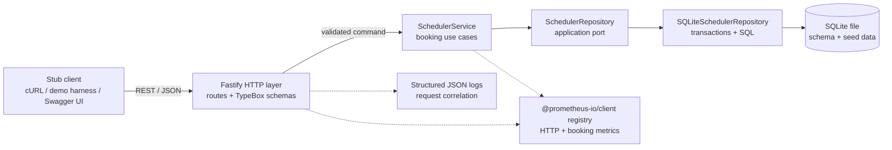
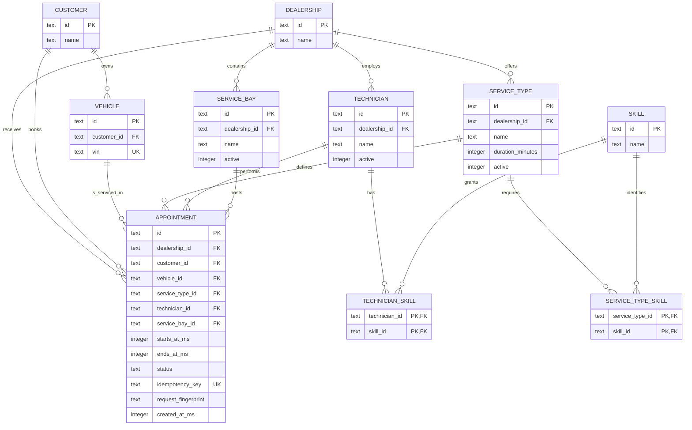
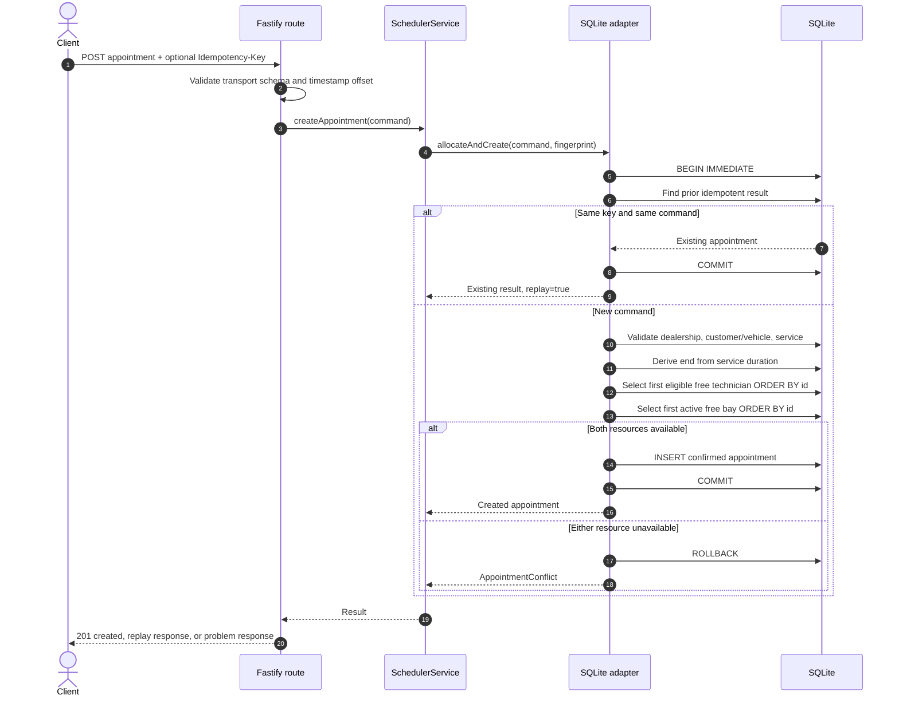

# System Design: Unified Service Scheduler

**Scenario:** A — The Unified Service Scheduler  
**Implemented layer:** Backend REST service  
**Document status:** Assessment design and production evolution plan

## 1. Executive summary

The service creates a confirmed vehicle-service appointment only when one active service bay and one active, qualified technician at the requested dealership are both free for the service's entire duration. It then persists the appointment with its customer, vehicle, service type, technician, and bay associations.

The assessment implementation is a modular TypeScript service using Fastify and an embedded SQLite database. SQLite makes the repository clone-and-run while still demonstrating durable state and transactional correctness. The application layer depends on a repository port rather than database APIs, making PostgreSQL the intended production adapter. The central invariant is enforced during appointment creation, not by trusting an earlier availability response.

## 2. Goals and non-goals

### Goals

- Make the three scenario requirements directly observable through a small REST API.
- Prevent confirmed appointments from double-booking either resource type.
- Make time and interval semantics explicit and testable.
- Persist the complete confirmed association and expose it for retrieval.
- Provide a zero-setup local reviewer experience.
- Demonstrate a credible path to horizontal scale, stronger database constraints, and distributed observability.
- Keep domain and application logic independent of Fastify and SQLite.

### Non-goals for this MVP

- Authentication, authorization, or multi-tenant dealership entitlements
- Customer, vehicle, technician, service type, or bay administration APIs
- Dealership opening hours, holidays, technician leave, breaks, or utilization policies
- Bay equipment/capability matching beyond dealership and active state
- Appointment cancellation, rescheduling, waitlists, or suggested alternative slots
- Notifications, payments, invoicing, and downstream dealer-management integration
- A browser frontend; OpenAPI, cURL, and the demo harness stub that layer

These exclusions are made visible rather than filled with invented requirements.

## 3. Assumptions

1. A service type owns a positive duration in minutes. The client cannot submit or override duration.
2. `startsAt` must be an ISO 8601 date-time containing `Z` or an explicit numeric offset. The service normalizes it to UTC.
3. Appointment ranges use half-open semantics: `[start, end)`. An appointment ending at 10:00 and another starting at 10:00 do not overlap.
4. A booking needs exactly one active bay and exactly one active technician for its full duration.
5. The technician belongs to the requested dealership and holds the requested service skill.
6. The vehicle belongs to the supplied customer. Vehicle/dealership enrollment is not modelled in the MVP.
7. Only `confirmed` appointments consume technician or bay capacity.
8. Availability is advisory. Appointment creation is authoritative and rechecks all references, eligibility, and overlap conditions atomically.
9. When several allocations are valid, resources are selected in stable identifier order. This makes behavior deterministic; workload balancing is future policy.
10. Seed data is assessment/demo data, not an administration model.

## 4. Architecture



The dependency direction points inward. Infrastructure implements an interface owned by the application boundary; neither the booking use case nor domain rules import Fastify or SQLite.

### Component responsibilities

| Component                       | Responsibility                                                                                             |
| ------------------------------- | ---------------------------------------------------------------------------------------------------------- |
| Fastify composition root        | Constructs dependencies, registers OpenAPI, routes, errors, metrics, and lifecycle hooks                   |
| HTTP routes and TypeBox schemas | Validate transport input, map application results to status codes, and generate an OpenAPI contract        |
| SchedulerService                | Owns use-case orchestration: availability, create appointment, idempotent replay, and retrieval            |
| Domain types and errors         | Define appointment semantics, explicit failure categories, and interval rules                              |
| SchedulerRepository port        | Describes the persistence operations required by the application without leaking SQL                       |
| SQLite adapter                  | Creates schema/seeds, performs atomic allocation, persists appointments, and answers readiness checks      |
| SQLite file                     | Durable assessment datastore with foreign keys, checks, uniqueness, and lookup indexes                     |
| Logging and metrics             | Provide request correlation, outcome counts, latency, and runtime health without logging customer payloads |
| Demo harness                    | Acts as the stubbed client and presents the acceptance flow without a frontend                             |

## 5. Domain and data model



SQLite stores timestamps as UTC epoch milliseconds, avoiding local-time comparisons. Foreign keys preserve the confirmed associations; checks and partial indexes protect valid state; and database triggers reject overlapping confirmed appointments even if a future code path bypasses the normal allocator. Application checks additionally give callers specific domain errors.

For two half-open intervals `existing=[a,b)` and `requested=[x,y)`, overlap exists exactly when:

```text
a < y AND b > x
```

Equality at either touching boundary is therefore allowed.

## 6. API surface

| Method and path                            | Success        | Role                                                                        |
| ------------------------------------------ | -------------- | --------------------------------------------------------------------------- |
| `GET /api/v1/dealerships/:id/availability` | `200`          | Counts eligible, unbooked technicians and bays for a service and start time |
| `POST /api/v1/appointments`                | `201`          | Atomically selects both resources and creates a confirmed appointment       |
| `GET /api/v1/appointments/:id`             | `200`          | Returns the persisted, expanded appointment                                 |
| `GET /health/live`                         | `200`          | Process liveness                                                            |
| `GET /health/ready`                        | `200` or `503` | Database readiness                                                          |
| `GET /metrics`                             | `200`          | Prometheus exposition                                                       |
| `GET /openapi.json`                        | `200`          | Generated API contract                                                      |
| `GET /docs`                                | `200`          | Interactive Swagger UI                                                      |

Errors use RFC 9457-style `application/problem+json` documents with a stable `code` and request correlation ID. Full commands are in [docs/API_EXAMPLES.md](./docs/API_EXAMPLES.md).

## 7. Data flows

### 7.1 Advisory availability

```mermaid
sequenceDiagram
    autonumber
    actor Client
    participant HTTP as Fastify route
    participant Service as SchedulerService
    participant Repo as SchedulerRepository
    participant DB as SQLite

    Client->>HTTP: GET availability(serviceTypeId, startsAt)
    HTTP->>HTTP: Validate ID and offset-aware timestamp
    HTTP->>Service: checkAvailability(query)
    Service->>Repo: read service duration and free-resource counts
    Repo->>DB: Validate dealership/service; query eligible resources
    DB-->>Repo: duration, technician count, bay count
    Repo-->>Service: availability snapshot
    Service-->>HTTP: startsAt, derived endsAt, counts, available
    HTTP-->>Client: 200 JSON
    Note over Client,DB: This response reserves nothing.
```

`available` is true only when both counts are greater than zero. Returning the separate counts explains which side is constrained without exposing private employee data.

### 7.2 Authoritative booking



`BEGIN IMMEDIATE` obtains the SQLite write reservation before the authoritative reads. Competing writers against the same database file cannot both observe and allocate the same free resource. Every validation, selection, and insert belongs to the same transaction.

### 7.3 Retrieval

The identifier route reads the appointment and its associated display fields through the repository. A missing identifier maps to a stable `404` problem. Retrieval demonstrates that confirmation was persisted rather than held in process memory.

## 8. Technology choices

| Choice                              | Why it fits                                                                                             | Accepted tradeoff                                              |
| ----------------------------------- | ------------------------------------------------------------------------------------------------------- | -------------------------------------------------------------- |
| Node.js 24 + TypeScript             | Modern runtime, built-in test runner and SQLite module, strict compile-time checks, fast reviewer setup | JavaScript runtime needs runtime boundary validation           |
| Fastify                             | Small, fast HTTP core with strong schema hooks, Pino logging, injection tests, and OpenAPI ecosystem    | Smaller general-enterprise ecosystem than some full frameworks |
| TypeBox                             | One schema definition serves runtime validation, static inference, and OpenAPI generation               | Transport types remain deliberately separate from domain types |
| `node:sqlite`                       | Durable ACID storage without a database install or native package dependency                            | Synchronous access and one-writer scaling ceiling              |
| Direct SQL behind a repository port | Makes transactions and overlap predicates reviewable; avoids an ORM hiding locking behavior             | More handwritten mapping code                                  |
| `@prometheus-io/client`             | Maintained Prometheus client with standard exposition and inexpensive Node/process metrics              | Full traces require later OpenTelemetry integration            |
| `node:test` through `tsx`           | Minimal runner surface, TypeScript tests, no separate framework                                         | Fewer batteries than larger test ecosystems                    |
| OpenAPI + cURL/demo harness         | Meets the backend-only client-stub requirement and keeps behavior inspectable                           | Not a production customer UX                                   |

## 9. Concurrency, consistency, and idempotency

### SQLite assessment implementation

Booking is a transaction around the complete decision. The adapter starts the write transaction before checking resource overlaps, chooses resources deterministically, inserts the appointment, and commits. Any failure rolls back. This avoids the classic check-then-insert race that would occur if availability and insertion were separate database operations.

The optional `Idempotency-Key` protects clients retrying after a timeout. The service fingerprints the normalized booking command:

- same key and same fingerprint: return the existing appointment and mark the response as replayed;
- same key and a different fingerprint: reject the key reuse;
- no key: each call is a new booking attempt.

This does not make availability reservational. It makes a single create intent safe to retry.

### PostgreSQL production evolution

The first production adapter would replace application-only conflict prevention with database constraints. PostgreSQL range types can make double-booking structurally impossible:

```sql
CREATE EXTENSION IF NOT EXISTS btree_gist;

ALTER TABLE appointments
  ADD CONSTRAINT no_confirmed_technician_overlap
  EXCLUDE USING gist (
    technician_id WITH =,
    tstzrange(starts_at, ends_at, '[)') WITH &&
  ) WHERE (status = 'confirmed');

ALTER TABLE appointments
  ADD CONSTRAINT no_confirmed_bay_overlap
  EXCLUDE USING gist (
    service_bay_id WITH =,
    tstzrange(starts_at, ends_at, '[)') WITH &&
  ) WHERE (status = 'confirmed');
```

The adapter would select candidate resources in a transaction, attempt the insert, and retry with another candidate on an exclusion violation. Database constraints remain the final guard across all replicas and future code paths.

## 10. Reliability and failure handling

| Failure                                                        | Current behavior                                       | Production extension                                       |
| -------------------------------------------------------------- | ------------------------------------------------------ | ---------------------------------------------------------- |
| Malformed input or missing time offset                         | Rejected at the HTTP boundary with `400`               | Track validation rate; apply abuse limits                  |
| Unknown dealership, service, customer, vehicle, or appointment | Stable domain problem response                         | Avoid revealing cross-tenant existence after auth is added |
| Vehicle/customer mismatch                                      | Rejected before allocation                             | Audit suspicious repeated attempts                         |
| No technician or bay                                           | `409 Conflict`; no partial record                      | Optionally return ranked alternative slots                 |
| Concurrent booking                                             | Serialized authoritative transaction; one request wins | PostgreSQL exclusion constraints and bounded retry         |
| Retried create after uncertain response                        | Same key/command replays prior result                  | Define retention and tenant scope for idempotency records  |
| Database unavailable or corrupt                                | Readiness fails; request logs carry request ID         | Managed PostgreSQL, replicas, backups, restore drills      |
| Process termination                                            | Committed SQLite state remains durable                 | Graceful draining and orchestrator restart policies        |

No distributed service can guarantee that an earlier availability response remains true. The API intentionally communicates conflict as an expected business outcome rather than a server failure.

## 11. Scalability and performance

### Present envelope

The assessment runs as one process with one embedded file. Reads are simple indexed lookups; the dataset and payloads are small; writes are brief and serialized. This prioritizes reviewer repeatability and correctness over synthetic throughput.

Indexes should support the resource overlap filters, appointment retrieval, idempotency lookup, technician skills, and dealership resource filters. Metrics make transaction duration and conflict frequency visible before optimization.

### Scale-out plan

1. Implement the existing repository port with PostgreSQL and a bounded connection pool.
2. Add GiST exclusion constraints as the cross-replica correctness boundary.
3. Run stateless API replicas behind a load balancer; keep idempotency and appointments in PostgreSQL.
4. Partition or shard by dealership only after evidence requires it; a dealership is the natural booking-consistency boundary.
5. Cache immutable service catalog data, not availability decisions.
6. Add cursor pagination to administrative appointment queries when such APIs exist.
7. Publish appointment events through an outbox for notifications and integrations without extending the booking transaction to remote systems.

The synchronous SQLite adapter is intentionally not represented as production-scale. The port and tests reduce migration risk without prematurely deploying infrastructure for a take-home exercise.

## 12. Observability

### Implemented

- Fastify/Pino structured logs with request ID, route, status, duration, and error code
- No request-body logging, limiting exposure of customer and vehicle data
- Liveness and database-backed readiness endpoints
- Prometheus process/default metrics plus HTTP and booking outcome instrumentation
- Stable problem codes for log and metric grouping
- Demonstrable availability, booking, conflict, replay, and retrieval paths

Useful initial dashboards would show request rate/error/duration by route, booking outcomes, resource conflicts by dealership and service type, idempotent replay rate, database transaction latency, event-loop lag, and readiness failures.

### Production additions

- OpenTelemetry HTTP and database spans propagated through `traceparent`
- Trace/metric exemplars and centralized structured-log ingestion
- Redaction policy for IDs, VINs, customer data, and headers
- Service-level objectives such as 99.9% successful API availability and booking p95 below an agreed threshold, excluding business conflicts
- Alerts on sustained `5xx`, readiness failure, database saturation, and unusual conflict-rate changes
- Synthetic booking probes against a dedicated non-customer dealership

Business conflicts (`409`) must not be counted as platform errors, though their rate is operationally useful.

## 13. Security and privacy

The MVP validates every external field, rejects ambiguous timestamps, uses parameterized SQL, binds to localhost by default, avoids logging request bodies, and runs its Docker image as a non-root user. Those measures do not replace a production identity and tenant model.

Before launch, add:

- OIDC authentication and dealership-scoped RBAC/ABAC authorization
- tenant predicates in every query and tenant-aware idempotency keys
- TLS at ingress and encryption at rest with managed key rotation
- request-size, rate, and concurrency limits
- CORS and security-header policy for the real client
- tamper-evident audit events for appointment lifecycle changes
- data classification, retention, deletion, and access-review processes
- secret management, dependency/SBOM scanning, image signing, and patch SLAs
- threat modelling for enumeration, cross-dealer access, retry abuse, and sensitive log leakage

## 14. Test strategy

The test pyramid is intentionally weighted toward rules and integration points:

- **Domain/unit:** offset-aware timestamp parsing, end-time derivation, and half-open overlap boundaries.
- **Repository/integration:** schema/seeds, skill matching, active-resource filtering, atomic persistence, conflict, back-to-back bookings, idempotent replay, and mismatch rejection.
- **HTTP/API:** schema validation, status codes, content types, problem details, headers, retrieval, health, and metrics.
- **Tooling:** strict TypeScript, lint, format check, production build, and a deterministic demo script.

Tests use isolated temporary SQLite files so they exercise real constraints without sharing state. Production PostgreSQL would add adapter contract tests and a contention test that submits simultaneous overlapping bookings from independent connections.

## 15. Acceptance-criteria traceability

| Assessment requirement                                                                   | Design response                                                                                                            | Verification evidence                                               |
| ---------------------------------------------------------------------------------------- | -------------------------------------------------------------------------------------------------------------------------- | ------------------------------------------------------------------- |
| Request a service appointment for a vehicle, service type, dealership, and desired time  | `POST /api/v1/appointments` accepts those identifiers plus customer and explicit-offset start time                         | HTTP creation test and demo happy path                              |
| Check availability of a service bay and qualified technician for the whole duration      | Service-owned duration, skill join, active/dealership filters, half-open overlap predicate, advisory availability endpoint | Availability, skill, overlap, inactive-resource, and boundary tests |
| Create a persistent appointment associating customer, vehicle, technician, and bay       | Atomic repository operation inserts a `confirmed` row with foreign keys; retrieval returns the expanded association        | Persistence/retrieval test and restart-stable SQLite file           |
| Backend exposes REST and uses a persistent database                                      | Fastify JSON API plus SQLite file                                                                                          | OpenAPI document, cURL examples, and integration tests              |
| Client side is mocked or stubbed                                                         | Swagger UI, cURL guide, and executable demo harness                                                                        | `npm run demo` and `docs/API_EXAMPLES.md`                           |
| Core business logic has tests                                                            | Domain, repository, and HTTP suites focus on allocation invariants                                                         | `npm test` and `npm run test:coverage`                              |
| Scalability, performance, reliability, maintainability, and observability are considered | Repository port, transactional design, production evolution, failure table, modular boundaries, metrics/logging plan       | This document and `npm run verify`                                  |
| GenAI use is described and verified                                                      | Transparent strategy, parallel review, reproducible quality gates, and ownership statement                                 | Section 17 and README AI Collaboration Narrative                    |

## 16. Architecture decisions and alternatives

### ADR-001: Implement the backend layer

**Decision:** Implement the REST backend and stub the frontend.  
**Why:** Scenario A's strongest risks are transactional allocation, persistence, and concurrency. A backend demonstrates those directly.  
**Consequence:** User experience is represented by Swagger, cURL, and a demo harness rather than a polished browser UI.

### ADR-002: Use SQLite for the assessment, PostgreSQL for production

**Decision:** Use `node:sqlite` behind a repository port.  
**Why:** It provides real persistence and transactions with no reviewer infrastructure.  
**Consequence:** One writer and synchronous access cap scale; the production adapter and database constraints are explicitly designed, not claimed as already present.

### ADR-003: Use half-open intervals

**Decision:** Model every appointment as `[start,end)`.  
**Why:** The rule handles back-to-back work without a fabricated gap and maps directly to PostgreSQL range types.  
**Consequence:** Every overlap query and test must retain the same boundary convention.

### ADR-004: Recheck during booking

**Decision:** Keep availability advisory and place the decisive check inside the write transaction.  
**Why:** Reserving through a GET response is impossible; separating the final check would create a race.  
**Consequence:** A client must handle `409` even after seeing `available: true`.

### ADR-005: Select resources deterministically

**Decision:** Choose the eligible technician and bay in ascending ID order.  
**Why:** Predictable behavior improves review and testing while allocation policy is unspecified.  
**Consequence:** This is not fair or utilization-aware; production should introduce a versioned policy such as least-loaded or round-robin selection.

### ADR-006: Keep SQL visible rather than introducing an ORM

**Decision:** Write parameterized SQL inside the adapter.  
**Why:** The critical overlap and transaction behavior stays auditable and the schema is compact.  
**Consequence:** Mappings and migrations require explicit code; a query builder could be reconsidered as the model grows.

### Alternatives considered

- **Precomputed time slots:** rejected because service durations vary and slot materialization complicates calendars and timezone changes.
- **In-memory storage:** rejected because the assessment explicitly requires persistence.
- **Redis locks:** rejected for the MVP and not preferred as the final correctness boundary; database constraints are easier to reason about transactionally.
- **Microservices per resource:** rejected because they introduce distributed coordination before domain or scale evidence justifies it.
- **Trusting the availability endpoint:** rejected because it cannot prevent a race between read and create.

## 17. GenAI-assisted design process

OpenAI Codex was used as an essential design and engineering collaborator. The process was intentionally structured around verification:

1. The assessment was extracted separately from the implementation plan so suggested tools and document wording were treated as source material, not hidden instructions.
2. The scenario options were compared for team-lead signal, delivery risk, and natural fit with the persistent-backend requirement. Scenario A was selected for its concurrency and modelling depth.
3. The design prompt fixed invariants, scope boundaries, stack, and production evolution before code generation. This prevented AI-generated feature sprawl.
4. Parallel agents worked on requirements/design review, implementation/scaffold review, and documentation. Their outputs were reconciled against one route contract and one seed model.
5. Generated code was checked by strict types, linting, formatting, tests, a production build, and live API/demo execution. Claims in this document were then compared with the implementation rather than copied from an initial design.
6. Refinement focused on failure-prone areas: offset-aware time, `[start,end)` boundaries, qualification, inactive resources, atomic recheck, idempotent retry, stable error contracts, and honest limits of SQLite.

AI proposed and accelerated alternatives; it did not remove the need to choose product semantics or own the outcome. The final design is deliberately explainable without referring to a prompt transcript, and its important properties have executable evidence.

## 18. Future product decisions

Before extending the implementation, stakeholders should decide:

- dealership-local working calendars and daylight-saving behavior;
- technician leave, breaks, and maximum utilization;
- bay capabilities and services needing multiple resources;
- cancellation/rescheduling rules and status transitions;
- allocation fairness and manual overrides;
- alternative-slot ranking;
- idempotency retention and scope;
- cross-dealership vehicle/customer identity;
- notification and dealer-management integration contracts.

Making these questions explicit avoids encoding accidental policy as infrastructure.
